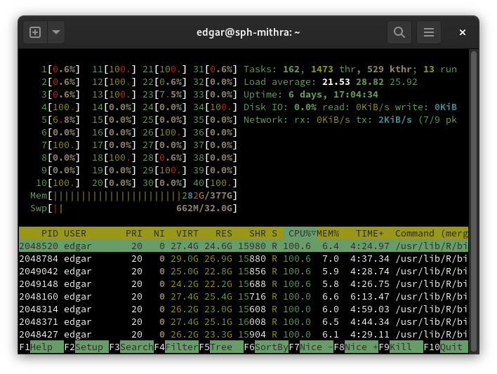

# Server information

This section lists information about the various servers and how to assess their status + suitability for work.

## Server attributes

The following table lists attributes of the servers as of March 23, 2023.

| type    | name   | ip            | cores | threads | max clock | memory | capacity |
| :-:     | :-:    | :-:           | :-:   | :-:     | :-:       | :-:    | :-:      |
| Work    | tiamat | 10.174.192.10 | 24    | 48      | 3.2 GHz   | 512 GB | 1.8 TB   |
| Work    | mithra | 10.174.192.11 | 20    | 40      | 4.5 GHz   | 384 GB | 1.9 TB   |
| Work    | dagda  | 10.174.192.12 | 16    | 16      | 2.8 GHz   | 128 GB | 220 GB   |
| Work    | shiva  | 10.174.192.14 | 24    | 48      | 3.2 GHz   | 512 GB | 1.8 TB   |
| Storage | gate   | 10.174.192.20 | unk.  | unk.    | unk.      | unk.   | 32 TB    |
| Storage | qnap   | 10.174.192.21 | 4     | 4       | 2.4 MHz   | 2 GB   | 29 TB    |
| Storage | qnap2  | 10.174.192.22 | unk.  | unk.    | unk.      | unk.   | 44 TB    |
| Storage | qnap3  | 10.174.192.23 | 4     | 4       | 1.7 GHz   | 2 GB   | 87 TB    |
| Storage | qnap4  | 10.174.192.24 | 4     | 4       | 1.7 GHz   | 4 GB   | 2.7 TB   |

Notes:

- `capacity` for computational machines refers to that of the home directory; for storage machines, it refers to the total size of the hard drive pool.
- To assess CPUs: `sudo dmidecode -t processor`
- To assess memory: `sudo dmidecode -t memory`
- To assess disk: `df -h`

## Server resource monitor

[Munin](http://munin-monitoring.org/) is available on the servers for resource monitoring purposes. This can be used, for example, to:

- Determine what machines are available for running jobs;
- Help debug the causes of crashes and freezes; and
- Know ahead-of-time what potential problems may cause a machine to crash before it does.

Munin is hosted on the `dagda` machine due to its low utilization compared to the other machines. To access Munin, navigate to [10.174.192.12:8080/munin/]() in your browser. You will be greeted with the following screen:

{width=600px}

On the left-hand side of the main page is the navigation pane. From here, you can navigate to dashboards that summarize various properties of the machines. At the top left are some **quick links** to the most useful dashboards. Underneath that, another section of interest is the **problems** section, which will list any notices regarding the health of the machines.

On the right-hand side is the page content. Normally, various graphs will appear here. On the main page, there are instead some links to machine-specific dashboards, with any problems highlighted in red or yellow.

The following sections will dive into specific Munin dashboards.

### Memory utilization

Memory utilization is a very complicated topic, in part because the kernel does so much work behind the scenes so that programs don't have to worry about  the finer details of memory management. This subsection will focus specifically on two main aspects of memory use:

- `unused`: Memory marked as `unused` exists in RAM and is freely available for programs to use. In an ideal situation, there will be enough unused memory for your programs, and under normal operation there will usually be some unused memory.

- `swap`: Memory marked as `swap` exists in your _swap space_, which is a portion of the _disk_ that is set aside to accommodate extra memory. Swap memory is **extremely slow** in comparison to unused memory - typical RAM can max out at 12 GB/s for DDR3 memory and over 32 GB/s for DDR4 memory, while a typical hard drive maxes out at around 160 MB/s. For computers with SSDs, the difference is not as egregious but still substantial.

Swap memory should only be used as a last resort, and, indeed, the kernel considers it as such. When there is no unused memory, the kernel will start transferring memory from your RAM to your swap space in a process known as **swapping**. The effect of this is that programs using that memory will be extremely slowed down, because the swapped memory must first be transferred _back_ to the RAM before it can be used.

**If a machine starts swapping, keep an eye on it!** A little swap can be OK, but once all of the swap space is used, the machine has run out of memory and the kernel will start terminating programs. The process that does this is called the [out-of-memory (OOM) killer](https://www.kernel.org/doc/gorman/html/understand/understand016.html), which calculates the _badness_ for each process by weighing the amount of memory it uses vs. how long it has been running. The exact algorithm for determining _badness_ can be found on the linked page. **In most cases, _your program will have the most badness_ and will be killed by the OOM killer** vs. other system processes that have been running for a long time (and therefore have less _badness_), so it's important to pay attention!

An example of a memory utilization graph is shown below - notice how there are some brief periods where the computer starts swapping (at one point it even gets so bad that the monitoring software can't keep up and a gap shows up in the graph!):

### Load average

The **load average** refers to the current average utilization of processing power. A load of 0% means that the machine is idle, while a load of 100% means that the machine is fully being used.

**The load average can go above 100%** - this means that processes are requesting more power than the machine can provide and the kernel is trying to distribute work fairly among processes. This means that, as a simplified example, if there are two programs competing for all of the available threads, then the kernel may decide to pause one program, work on the other, pause that, return to the first program, and repeat until more resources become available.

An example of a load average graph is shown below - notice how it briefly peaks above 100%:

## How to pick a server to work on

1. **Is it capable?** Refer to the [server attributes](#server-attributes) table and ensure that the server has enough processing speed and memory.

    - Not sure how much memory your code might use? Do a short test run and monitor the resource usage closely (see [the next section](#more-precise-monitoring)) - if it ends up using more memory than you expect then you can kill it before it freezes up the server and gets killed on its own.
    - For running **simple models**: `max clock` is the most important attribute. This is because functions like `glm()`, `survival::clogit()`, `nlme::lme()`, etc. only run on a single core.
    - For running **parallel jobs**: multiply `max clock` by the number of `threads`. Each thread will be executing code simultaneously.
      - **Caution**: in general most parallel jobs will create a full copy of your data set before running so that each subprocess has something to work with. Be sure to carefully monitor your memory usage if running parallel jobs with a large data set, or running a large number of parallel jobs on a small data set!

2. **Is there room?** Refer to the [server resource monitor](#server-resource-monitor) section and ensure that the actual amount of processing power and memory available is enough for your job.

3. **Monitor your job.** Be sure to revisit \#2 occasionally as your jobs are running!

    - Other people may have started jobs on the same server and it may be faster to switch to a different one.
    - The amount of memory available and what your job requires may be different from what you originally thought. **If the machine starts swapping, be on the lookout!** Swap memory is extremely slow and should be used sparingly. Additionally, once the swap is fully used, the kernel will start terminating programs.

## More precise monitoring

While the server resource monitor is useful for getting a quick overview of the state of all of the work servers, there are some key limitations:

1. The resource monitor only updates every 5 minutes. This means that jobs that cause a very quick resource spike may not be able to be detected before they start causing issues.

2. Per-thread CPU monitoring isn't available. It may be more instructive to see per-thread utilization rather than a machine load average when, for example, deciding whether or not to parallelize a job or seeing if a single-core function may be better replaced by a quicker one (e.g. an `nlme::lme()` on large data vs. a `mgcv::bam()`).

In the above cases, `htop` is your best friend. `htop` can be accessed by logging in to the command line and typing `htop`. You will be presented with a window like the one below:

In `htop`, the meters at the top left represent the utilization of each individual core and are followed by meters for RAM and swap. Below that, you can see a table of all processes along with the user running them and some information about CPU and memory utilization.

Clicking on cells in the header row will sort the processes by that column. In the above example, we can see that the table is being sorted by CPU utilization. You can also press F4 or click the `Filter` button at the bottom to enter a search term to filter rows by.
