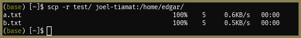
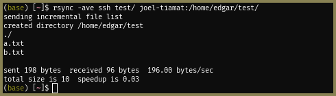
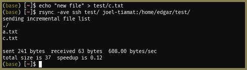

# Transferring files

Last updated March 24, 2022

This guide contains some instructions for transferring files securely via SSH to Linux and other Unix/Unix-like servers.

Formatting notes:

* Throughout the document I will be using `monospace font` to refer to commands, command arguments, files, and other keywords.
* Every section will have an example located right after the paragraph that begins with the bolded words **For example**, so if you’re in a rush you can just CTRL-F!

## Simple transfers: `scp`

`scp` ("secure copy") is a program that exists by default on all modern UNIX-like systems and uses an SSH connection to transfer data to a remote server. This is what most SSH consoles use in the background, I believe - MobaXTerm, PuTTY,  etc. Basic usage is similar to the normal copy command and takes the form:

```bash
scp [-options] source dest
```

where `source` and `dest` are the source and destination paths (relative to the home folder) and `-options` is an optional list of options. The "remote" part comes into play by specifying a prefix for the source, destination, or both that indicates what machine the path is pointing to, if not the current machine, by `using user@hostname.or.ip.address:`. For this tutorial I have aliased the server IP addresses to `joel-tiamat`, `joel-mithra`, etc. using my [SSH config](https://www.ssh.com/academy/ssh/config), but that is beyond the scope of this tutorial.

### Transferring files

**For example**, if I want to copy the file `a.txt`, in the current directory, from my computer to my home directory on one of the servers:

```bash
scp test/a.txt joel-tiamat:/home/edgar/
```

What this looks like in practice:


Note that you are able to see the progress of the transfer while it is transferring. In the above screenshot it just shows up as “100%” but in practice this will start at 0% and update every few milliseconds.

Similarly, I can copy the file back by simply reversing the order of paths:

```bash
scp joel-tiamat:/home/edgar/a.txt ~/test/
```

Or, I can transfer the copy from one machine to a different remote machine:

```bash
scp joel-tiamat:/home/edgar/a.txt joel-mithra:/home/edgar/
```

The last command might be useful if you are transferring a big file that you do not have space for on your computer if you cannot grant direct access from one machine to the other – otherwise, it’s always faster to just do a direct transfer between the machines because it takes your computer out of the equation.

### Transferring folders

If you want to transfer a folder instead of a file, you can use the same command but you must now add the -r (recursive) 

```bash
scp -r source dest
```

**For example**, say I want to copy the entire folder containing `a.txt` instead of just `a.txt`:

```bash
scp -r test/ joel-tiamat:/home/edgar
```

Output is the same as before, but you can now see multiple files being transferred:



As before, you can copy something to your machine instead of from your machine by reversing the paths.

### Other `scp` options

`scp` has a few other options that you can apply to tweak the behaviour of the command, which you can access by typing `man scp` ("manual for `scp`"). I have highlighted key options below:

* `-C` (upper case `C`): Enable compression of the file in transit. This requires your machine and the destination machine to both be powerful enough to compress the data faster than it is being sent and this may not always be the case – I personally don’t use this.
* `-i identity_file`: Use the specified identity file to connect to the remote machine. This is necessary if the remote machine does not allow password-based logins.
* `-l limit`: Limit the transfer speed to this many Kbit/s
* `-q`: Disable the live progress indicator. This is useful for saving space if you are using a shared cluster with something like SLURM, because otherwise all of the progress would be dumped to a text file that could grow large quickly.

## Large transfers: `rsync`

If you are transferring relatively large folders, `rsync` ("remote sync") is preferable to `scp` because `rsync` only transfers items that have not changed since the last transfer. This is useful if, for example, you are transferring a very large data set where parts of the data set are updated periodically, but not the whole thing. rsync does this by:

1. Checking if the destination folder exists,
2. If it does, checking if the file is absent, and
3. If present, checking if the remote file has a different modification time or size.

If any of the above checks are violated, the file is copied over. Otherwise, the file is not transferred.

The `rsync` command is very similar to `scp` and uses essentially the same format:

```bash
scp -ave ssh [-options] source dest
```

where the `-ave ssh` here means:

* `-a`: archive the files (make a copy)
* `-v`: be verbose (show me what’s happening)
* `-e ssh`: establish a connection using SSH

Though similar, `rsync` differs from `scp` in that you must provide the path to where you want the folder to exist, followed by a forward slash (`/`), rather than the folder that it exists in. This may be a little confusing but will be cleared through the example.

**For example**, let’s say I want to transfer the same folder as before to the same destination. I have removed it from the destination for demonstration purposes. The command I would use is:

```bash
rsync -ave ssh test/ joel-tiamat:/home/edgar/test/
```

The output is as follows:



There is something very important to point out here: instead of before, where I specified the folder where I want the folder to be transferred into, i.e. `/home/edgar/`, I am specifying the exact path that the folder will appear at, i.e. `/home/edgar/test/`. If you had instead specified the same destination as in `scp`, you would find that `rsync` would have dumped the contents of the source folder into the destination folder, rather than creating a new folder inside the destination folder and dumping contents into that.

Now, let’s say I made a change to a file or added a new file and want to sync the changes. Notice what happens when I run the same command:



Only the changed file (`a.txt`) and a new file (`c.txt`), were copied! `b.txt` did not change between transfers and was not re-copied. This can be a huge time-saver and also help to save you money if you are being charged based on your bandwidth.

### Other rsync options

As before, here is a list of useful rsync options:
* `--compress`: Compress files being transferred. Similar to scp -C.
* `--copy-links`: Also copy links / shortcuts.
* `--progress`: Show the progress of the file currently being transferred. Unlike scp, there is no progress indicator by default. I usually add this to every rsync command because it’s easy to see if a transfer has locked up / frozen.
* `--remove-source-files`: Remove files from the source folder after they are transferred. This essentially turns rsync into a move command instead of a copy command.


## Interacting with the cloud: `rclone`

`rclone` is yet another tool for remote transfers that can handle interaction with cloud services, e.g. AWS S3, Google Drive, Microsoft Azure Blob Storage, etc. Unlike `rsync` and `scp`, `rclone` is not installed by default and you must grab a copy from [rclone.org](https://rclone.org).

I will not go into this extensively here as the `rclone` website has [extensive documentation available](https://rclone.org/docs/), but let me know if you need any help!